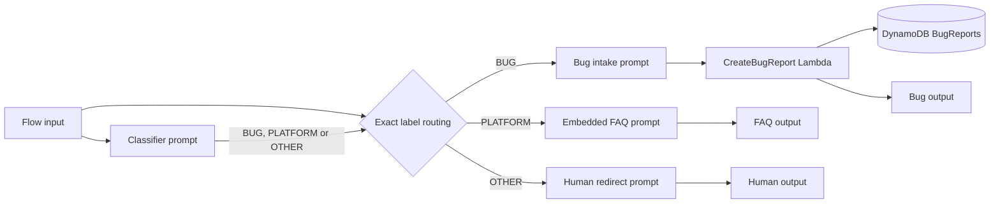

# Customer Support Chatbot with Amazon Bedrock Flows

A three-path customer support application for a fictional retailer, built with Amazon Bedrock Flows, prompt nodes, AWS Lambda and DynamoDB.

The Flow classifies each message and routes it to one of three independent handlers:

- **Bug report:** a prompt-based intake handler gathers a description, reproduction steps and environment details without inventing missing information. A native Flow `LambdaFunction` node then creates the ticket in DynamoDB and returns its ticket ID.
- **Platform question:** a prompt answers from the embedded Northstar Shop FAQ for orders, shipping, returns, refunds, payments, products, accounts and privacy.
- **Other request:** a separate prompt politely redirects the customer to the fictional support line at `+1-800-555-0147`.

## Architecture



The classifier is instructed to return one exact label. A bug report takes precedence when a message also mentions a platform topic, such as a payment page error. Customer messages are treated as untrusted data in all prompts.

## Project files

| File | Purpose |
| --- | --- |
| `cloudformation-tool.yaml` | Deploys the `BugReports` table, `create-bug-report-role` and `create-bug-report` Lambda function |
| `cloudformation-solution.yaml` | Deploys the prompt-based three-path Flow, Flow version and live alias |
| `cloudformation-testing.yaml` | Deploys the evaluation S3 bucket and Bedrock evaluation role |
| `create_bug_report.py` | Readable and unit-tested source for the inline Lambda implementation |
| `online_shop_faq.md` | Fictional platform FAQ used to develop the embedded prompt |
| `chat.py` | Terminal client for invoking the deployed Flow |
| `generate-eval-dataset.py` | Invokes the Flow and creates Bedrock Evaluations JSONL data |
| `flow-tests.json` | Test suite covering all three routes and prompt injection cases |
| `outputs/output_eval_dataset.jsonl` | Ten precomputed responses generated by the deployed Flow |
| `outputs/eval-run.log` | Exact routed node sequence for every automated test |
| `outputs/evaluation-observations.md` | Written observations from the live Flow evaluation run |
| `outputs/evidence/` | Privacy-safe rubric screenshots from the live AWS deployment |
| `REVIEWER-REMEDIATION.md` | Maps the first review feedback to the accepted implementation and evidence |

## Prerequisites

- An AWS account with Amazon Bedrock access enabled
- AWS CLI credentials configured for `us-east-1`
- Python 3.9 or newer
- Access to the selected Bedrock model, by default Amazon Nova Lite
- Permissions to create CloudFormation, IAM, Lambda, DynamoDB, S3 and Bedrock resources

> **[AWS availability notice (July 30, 2026)](https://docs.aws.amazon.com/bedrock/latest/userguide/agents-classic-maintenance-mode.html):**
> Amazon Bedrock Agents is now Agents Classic and is closed to new customers.
> `AWS::Bedrock::Agent` and `CreateAgent` work only in accounts with prior
> service activity. The Udacity reviewer approved a Prompt node as the intake
> replacement because AgentCore cannot be connected to a Bedrock Flow Agent
> node. Flow version 5 connects that intake Prompt directly to a supported
> `LambdaFunction` node, so ticket persistence is part of the deployed Flow.

Bedrock Agents Classic is available in `us-east-1`, `us-east-2` and `us-west-2`. This project standardises every command on `us-east-1`.

## 1. Install Python dependencies

```bash
python3 -m venv venv
source venv/bin/activate
pip install -r requirements.txt
```

## 2. Deploy the bug report tool

Deploy the exact resources required by the project:

```bash
aws cloudformation deploy \
  --template-file cloudformation-tool.yaml \
  --stack-name bug-report-tool-stack \
  --capabilities CAPABILITY_NAMED_IAM \
  --region us-east-1
```

The stack creates:

| Resource | Name |
| --- | --- |
| DynamoDB table | `BugReports` |
| IAM role | `create-bug-report-role` |
| Lambda function | `create-bug-report` |

Use [`lambda-test-event.json`](lambda-test-event.json) in the Lambda console or invoke the function from the CLI:

```bash
aws lambda invoke \
  --function-name create-bug-report \
  --payload fileb://lambda-test-event.json \
  --region us-east-1 \
  work/lambda-response.json

cat work/lambda-response.json
```

A successful response contains a generated `ticketId` and `"status":"OPEN"`. The solution Flow invokes this same function after `BugReportAssistant`. Confirm the matching item under **DynamoDB > BugReports > Explore table items**.

## 3. Deploy the Bedrock Flow

Deploy the solution stack:

```bash
aws cloudformation deploy \
  --template-file cloudformation-solution.yaml \
  --stack-name customer-support-flow-stack \
  --parameter-overrides \
    ModelId=amazon.nova-lite-v1:0 \
    DeploymentRevision=2026-08-21-r5 \
  --capabilities CAPABILITY_NAMED_IAM \
  --region us-east-1
```

The helper script performs both deployments:

```bash
./scripts/deploy.sh
```

Pass another model when needed:

```bash
./scripts/deploy.sh --model-id <supported-model-id-or-inference-profile-arn>
```

The helper script generates a fresh deployment revision automatically. When deploying manually, change `DeploymentRevision` each time the Flow definition changes. This forces CloudFormation to publish a new Flow version and update the `live` alias instead of leaving the alias on an older immutable version.

## 4. Chat with the Flow

Get the Flow and alias IDs:

```bash
aws cloudformation describe-stacks \
  --stack-name customer-support-flow-stack \
  --query 'Stacks[0].Outputs' \
  --output table \
  --region us-east-1
```

Start the terminal client:

```bash
python chat.py \
  --flow-id <your-flow-id> \
  --flow-alias-id <your-flow-alias-id> \
  --region us-east-1
```

Add `--trace` to request Flow traces.

## 5. Run local verification

These checks do not call AWS:

```bash
pip install -r requirements-dev.txt
cfn-lint -r us-east-1 -t \
  cloudformation-tool.yaml \
  cloudformation-solution.yaml \
  cloudformation-testing.yaml
python -m unittest discover -s tests -v
python generate-eval-dataset.py --tests-json flow-tests.json --validate-only
```

## 6. Generate the evaluation dataset

The committed `flow-tests.json` includes bug, platform and other prompts. It also tests routing precedence and prompt injection resistance.

```bash
python generate-eval-dataset.py \
  --tests-json flow-tests.json \
  --flow-id <your-flow-id> \
  --flow-alias-id <your-flow-alias-id> \
  --region us-east-1
```

The script prints the traced node sequence for each prompt. It writes `output_eval_dataset.jsonl` by default. Each line contains `prompt`, `referenceResponse` and a precomputed `modelResponses` entry identified as `my-flow-app`. Failed invocations are preserved with a `[FLOW_ERROR]` prefix so they cannot be mistaken for successful responses.

Bug tests cover both missing-detail follow-up wording and complete ticket creation. Every bug invocation reaches `CreateBugReport`; incomplete reports return the follow-up without a database write, while complete reports create an `OPEN` ticket.

The checked-in regression run invoked all ten tests against Flow version 5 with zero Flow errors. The trace log confirms that each test reached the correct dedicated output node and every bug case passed through the Lambda node. The completed Amazon Bedrock Evaluation job scored the submitted ten-response dataset at **1.00 Correctness** using Nova Pro as the LLM judge.

## 7. Run Bedrock Evaluations

Deploy the test resources:

```bash
aws cloudformation deploy \
  --template-file cloudformation-testing.yaml \
  --stack-name bug-report-testing-stack \
  --capabilities CAPABILITY_NAMED_IAM \
  --region us-east-1

aws cloudformation describe-stacks \
  --stack-name bug-report-testing-stack \
  --query 'Stacks[0].Outputs' \
  --output table \
  --region us-east-1
```

Record the `EvalDatasetBucketName` and `BedrockEvalRoleArn` outputs. Upload the dataset:

```bash
aws s3 cp output_eval_dataset.jsonl \
  s3://<EvalDatasetBucketName>/output_eval_dataset.jsonl \
  --region us-east-1
```

Create the LLM-as-a-judge job:

```bash
aws bedrock create-evaluation-job \
  --job-name flow-eval-run-1 \
  --role-arn <BedrockEvalRoleArn> \
  --evaluation-config '{
    "automated": {
      "datasetMetricConfigs": [{
        "taskType": "General",
        "dataset": {
          "name": "flow-eval-dataset",
          "datasetLocation": {
            "s3Uri": "s3://<EvalDatasetBucketName>/output_eval_dataset.jsonl"
          }
        },
        "metricNames": ["Builtin.Correctness"]
      }],
      "evaluatorModelConfig": {
        "bedrockEvaluatorModels": [{
          "modelIdentifier": "amazon.nova-pro-v1:0"
        }]
      }
    }
  }' \
  --inference-config '{
    "models": [{
      "precomputedInferenceSource": {
        "inferenceSourceIdentifier": "my-flow-app"
      }
    }]
  }' \
  --output-data-config '{"s3Uri":"s3://<EvalDatasetBucketName>/results/"}' \
  --region us-east-1
```

Review the completed job under **Amazon Bedrock > Evaluations**. Record the overall score in [`outputs/evaluation-observations.md`](outputs/evaluation-observations.md) and note routing, FAQ and bug-ticket patterns. This repository does not invent cloud evaluation results that have not been run in AWS.

## Verified rubric evidence

The evidence below was captured from the deployed `us-east-1` resources. Images are cropped to remove AWS account details while retaining the relevant configuration, input and response.

| Rubric requirement | Evidence |
| --- | --- |
| Full Flow with three paths, Lambda and separate outputs | [Live version 5 diagram](outputs/evidence/13-flow-version-5-lambda.png), [AWS console Flow diagram](outputs/evidence/01-flow-diagram.jpg) |
| Consistent classifier output | [Classifier prompt](outputs/evidence/02-classifier-prompt.jpg), [exact labels](outputs/evidence/02b-classifier-prompt-labels.jpg), [platform rule](outputs/evidence/02c-classifier-platform-rule.jpg) |
| Condition routing | [BUG and PLATFORM rules](outputs/evidence/03-condition-routing-rules.jpg), [default OTHER route](outputs/evidence/03b-condition-default-route.jpg) |
| Bug intake fields | [Required fields](outputs/evidence/04b-bug-required-fields.jpg) |
| Complete bug response with ticket ID | [Live Flow input and ticket response](outputs/evidence/14-bug-flow-ticket-created.png) |
| Bug follow-up response | [Input and answer](outputs/evidence/06c-bug-follow-up-input-and-answer.jpg), [follow-up continuation](outputs/evidence/06-bug-follow-up-response.jpg) |
| Flow-created DynamoDB record | [Matching `BugReports` item](outputs/evidence/15-dynamodb-matching-flow-ticket.png) |
| Embedded FAQ content | [Readable deployed prompt excerpt](outputs/evidence/16-faq-prompt-readable.png), [AWS console FAQ prompt](outputs/evidence/07b-faq-shipping-items.jpg) |
| Covered FAQ question | [Readable input and output](outputs/evidence/17-faq-covered-readable.png) |
| Uncovered FAQ question | [Readable input and support fallback](outputs/evidence/18-faq-uncovered-readable.png) |
| Other-request path | [Readable input and human redirect](outputs/evidence/19-other-request-readable.png) |
| Automated test suite | [`flow-tests.json`](flow-tests.json), [generated JSONL](outputs/output_eval_dataset.jsonl), [live trace log](outputs/eval-run.log) |
| Bedrock LLM-as-a-judge result | [Correctness 1.00 results page](outputs/evidence/12-evaluation-results.jpg) |
| Written evaluation observation | [Evaluation observations](outputs/evaluation-observations.md) |
| Live version 5 verification transcript | [Flow, ticket and route verification](outputs/live-flow-verification.md) |

## Cleanup

Empty the evaluation bucket before deleting its stack:

```bash
aws s3 rm s3://<EvalDatasetBucketName> --recursive --region us-east-1
aws cloudformation delete-stack \
  --stack-name bug-report-testing-stack \
  --region us-east-1
aws cloudformation delete-stack \
  --stack-name customer-support-flow-stack \
  --region us-east-1
aws cloudformation delete-stack \
  --stack-name bug-report-tool-stack \
  --region us-east-1
```

CloudFormation removes the infrastructure it created. If you built a Flow manually in the console, delete that resource there.

## Security and cost notes

- The Lambda validates required fields and length limits before writing a ticket.
- The IAM roles grant only the application actions each resource needs.
- The S3 evaluation bucket blocks public access and enables server-side encryption.
- Prompts explicitly separate untrusted customer input and include prompt injection tests.
- Deploying this project can incur AWS charges. Run cleanup after evaluation.

## License

This project is available under the [MIT License](LICENSE).
