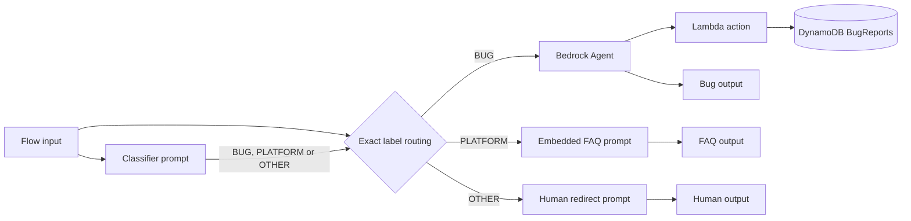

# Customer Support Chatbot with Amazon Bedrock Flows

A three-path customer support application for a fictional retailer, built with Amazon Bedrock Flows, Bedrock Agents, AWS Lambda and DynamoDB.

The Flow classifies each message and routes it to one of three independent handlers:

- **Bug report:** a Bedrock Agent gathers a description, optional reproduction steps and optional environment details, then calls a Lambda action to store an `OPEN` ticket in DynamoDB.
- **Platform question:** a prompt answers from the embedded Northstar Shop FAQ for orders, shipping, returns, refunds, payments, products, accounts and privacy.
- **Other request:** a separate prompt politely redirects the customer to the fictional support line at `+1-800-555-0147`.

## Architecture



The classifier is instructed to return one exact label. A bug report takes precedence when a message also mentions a platform topic, such as a payment page error. Customer messages are treated as untrusted data in all prompts.

## Project files

| File | Purpose |
| --- | --- |
| `cloudformation-tool.yaml` | Deploys the `BugReports` table, `create-bug-report-role` and `create-bug-report` Lambda function |
| `cloudformation-solution.yaml` | Deploys the Bedrock Agent, three-path Flow, Flow version and live alias |
| `cloudformation-testing.yaml` | Deploys the evaluation S3 bucket and Bedrock evaluation role |
| `create_bug_report.py` | Readable and unit-tested source for the inline Lambda implementation |
| `online_shop_faq.md` | Fictional platform FAQ used to develop the embedded prompt |
| `chat.py` | Terminal chat client with Bedrock Agent multi-turn support |
| `generate-eval-dataset.py` | Invokes the Flow and creates Bedrock Evaluations JSONL data |
| `flow-tests.json` | Test suite covering all three routes and prompt injection cases |
| `evaluation-observations-template.md` | Template for documenting evaluation results after an AWS run |

## Prerequisites

- An AWS account with Amazon Bedrock access enabled
- AWS CLI credentials configured for `us-east-1`
- Python 3.9 or newer
- Access to the selected Bedrock model, by default Amazon Nova Lite
- Permissions to create CloudFormation, IAM, Lambda, DynamoDB, S3 and Bedrock resources

Bedrock Agents Classic is available in `us-east-1`, `us-east-2` and `us-west-2`. This project standardises every command on `us-east-1`.

## 1. Install Python dependencies

```bash
python3 -m venv venv
source venv/bin/activate
pip install -r requirements.txt
```

## 2. Deploy and test the bug report tool

Deploy the exact resources required by the project:

```bash
aws cloudformation deploy \
  --template-file cloudformation-tool.yaml \
  --stack-name bug-report-tool-stack \
  --capabilities CAPABILITY_NAMED_IAM \
  --region us-east-1
```

The stack creates:

| Resource | Name |
| --- | --- |
| DynamoDB table | `BugReports` |
| IAM role | `create-bug-report-role` |
| Lambda function | `create-bug-report` |

Use [`lambda-test-event.json`](lambda-test-event.json) in the Lambda console or invoke the function from the CLI:

```bash
aws lambda invoke \
  --function-name create-bug-report \
  --payload fileb://lambda-test-event.json \
  --region us-east-1 \
  work/lambda-response.json

cat work/lambda-response.json
```

A successful response contains a generated `ticketId` and `"status":"OPEN"`. Confirm the matching item under **DynamoDB > BugReports > Explore table items**.

## 3. Deploy the Bedrock Agent and Flow

Retrieve the Lambda ARN:

```bash
BUG_REPORT_FUNCTION_ARN=$(aws cloudformation describe-stacks \
  --stack-name bug-report-tool-stack \
  --query "Stacks[0].Outputs[?OutputKey=='BugReportFunctionArn'].OutputValue" \
  --output text \
  --region us-east-1)
```

Deploy the solution stack:

```bash
aws cloudformation deploy \
  --template-file cloudformation-solution.yaml \
  --stack-name customer-support-bedrock-stack \
  --parameter-overrides \
    BugReportFunctionArn="$BUG_REPORT_FUNCTION_ARN" \
    ModelId=amazon.nova-lite-v1:0 \
  --capabilities CAPABILITY_NAMED_IAM \
  --region us-east-1
```

The helper script performs both deployments:

```bash
./scripts/deploy.sh
```

Pass another model when needed:

```bash
./scripts/deploy.sh --model-id <supported-model-id-or-inference-profile-arn>
```

After changing the Agent or Flow, deploy again so CloudFormation prepares the Agent, creates a new Flow version and updates the `live` alias.

## 4. Chat with the Flow

Get the Flow and alias IDs:

```bash
aws cloudformation describe-stacks \
  --stack-name customer-support-bedrock-stack \
  --query 'Stacks[0].Outputs' \
  --output table \
  --region us-east-1
```

Start the terminal client:

```bash
python chat.py \
  --flow-id <your-flow-id> \
  --flow-alias-id <your-flow-alias-id> \
  --region us-east-1
```

Add `--trace` to request Flow traces.

## 5. Run local verification

These checks do not call AWS:

```bash
pip install -r requirements-dev.txt
cfn-lint -r us-east-1 -t \
  cloudformation-tool.yaml \
  cloudformation-solution.yaml \
  cloudformation-testing.yaml
python -m unittest discover -s tests -v
python generate-eval-dataset.py --tests-json flow-tests.json --validate-only
```

## 6. Generate the evaluation dataset

The committed `flow-tests.json` includes bug, platform and other prompts. It also tests routing precedence and prompt injection resistance.

```bash
python generate-eval-dataset.py \
  --tests-json flow-tests.json \
  --flow-id <your-flow-id> \
  --flow-alias-id <your-flow-alias-id> \
  --region us-east-1
```

The script prints the traced node sequence for each prompt. It writes `output_eval_dataset.jsonl` by default. Each line contains `prompt`, `referenceResponse` and a precomputed `modelResponses` entry identified as `my-flow-app`. Failed invocations are preserved with a `[FLOW_ERROR]` prefix so they cannot be mistaken for successful responses.

Bug tests may supply `follow_up_responses`. The script resumes the same Flow execution when the Agent requests missing information.

## 7. Run Bedrock Evaluations

Deploy the test resources:

```bash
aws cloudformation deploy \
  --template-file cloudformation-testing.yaml \
  --stack-name bug-report-testing-stack \
  --capabilities CAPABILITY_NAMED_IAM \
  --region us-east-1

aws cloudformation describe-stacks \
  --stack-name bug-report-testing-stack \
  --query 'Stacks[0].Outputs' \
  --output table \
  --region us-east-1
```

Record the `EvalDatasetBucketName` and `BedrockEvalRoleArn` outputs. Upload the dataset:

```bash
aws s3 cp output_eval_dataset.jsonl \
  s3://<EvalDatasetBucketName>/output_eval_dataset.jsonl \
  --region us-east-1
```

Create the LLM-as-a-judge job:

```bash
aws bedrock create-evaluation-job \
  --job-name flow-eval-run-1 \
  --role-arn <BedrockEvalRoleArn> \
  --evaluation-config '{
    "automated": {
      "datasetMetricConfigs": [{
        "taskType": "General",
        "dataset": {
          "name": "flow-eval-dataset",
          "datasetLocation": {
            "s3Uri": "s3://<EvalDatasetBucketName>/output_eval_dataset.jsonl"
          }
        },
        "metricNames": ["Builtin.Correctness"]
      }],
      "evaluatorModelConfig": {
        "bedrockEvaluatorModels": [{
          "modelIdentifier": "amazon.nova-pro-v1:0"
        }]
      }
    }
  }' \
  --inference-config '{
    "models": [{
      "precomputedInferenceSource": {
        "inferenceSourceIdentifier": "my-flow-app"
      }
    }]
  }' \
  --output-data-config '{"s3Uri":"s3://<EvalDatasetBucketName>/results/"}' \
  --region us-east-1
```

Review the completed job under **Amazon Bedrock > Evaluations**. Copy [`evaluation-observations-template.md`](evaluation-observations-template.md), record the overall score and note routing, FAQ and bug-ticket patterns. This repository does not invent cloud evaluation results that have not been run in your AWS account.

## Cleanup

Empty the evaluation bucket before deleting its stack:

```bash
aws s3 rm s3://<EvalDatasetBucketName> --recursive --region us-east-1
aws cloudformation delete-stack \
  --stack-name bug-report-testing-stack \
  --region us-east-1
aws cloudformation delete-stack \
  --stack-name customer-support-bedrock-stack \
  --region us-east-1
aws cloudformation delete-stack \
  --stack-name bug-report-tool-stack \
  --region us-east-1
```

CloudFormation removes the infrastructure it created. If you built the Agent or Flow manually in the console, delete those resources there.

## Security and cost notes

- The Lambda validates required fields and length limits before writing a ticket.
- The IAM roles grant only the application actions each resource needs.
- The S3 evaluation bucket blocks public access and enables server-side encryption.
- Prompts explicitly separate untrusted customer input and include prompt injection tests.
- Deploying this project can incur AWS charges. Run cleanup after evaluation.

## License

This project is available under the [MIT License](LICENSE).
